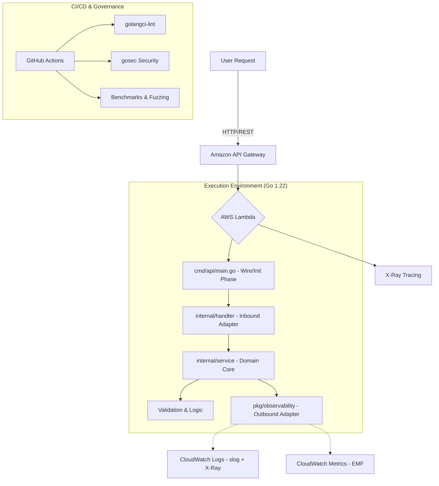

# 🚀 AWS Lambda Go: Big-Tech Grade Boilerplate


> *Gopher operando servidores AWS com a eficiência de uma "Nano Banana" — Rápido, Potente e Escalável.*

Este projeto estabelece o padrão ouro para o desenvolvimento de **AWS Lambdas em Go 1.22+**, seguindo as práticas de engenharia de gigantes como **Uber, Netflix e Amazon**. Focado em performance extrema, resiliência operacional e governança de código.

## 🏗️ Arquitetura Hexagonal (Simplified)

Utilizamos o padrão **Service/Handler** para garantir que sua lógica de negócio seja 100% testável e independente de eventos da AWS.



## 🌟 Diferenciais Big-Tech

### 1. 🛡️ Deployments Seguros (Canary)
Configurado para **Canary Deployments (10% em 5 minutos)** via AWS SAM + CodeDeploy.
*   **Rollback Automático:** Se os alarmes de erro dispararem durante o deployment, a AWS desfaz a atualização automaticamente, protegendo 90% dos seus usuários.

### 2. 📊 Métricas de Negócio (EMF)
Implementamos o **AWS CloudWatch Embedded Metric Format (EMF)**. Geramos métricas customizadas de alta cardinalidade sem adicionar latência ao handler ou aumentar o faturamento por chamadas de API externas.

### 3. 🔍 Observabilidade "Zero-Search"
Integração nativa de `log/slog` com `AWSTraceID`.
*   **Correlação Total:** Logs, métricas e traces compartilham o mesmo ID de contexto, permitindo depuração instantânea de erros em sistemas distribuídos.

### 4. ⚡ Engenharia de Performance (Benchmarks & Fuzz)
*   **Fuzz Testing:** O sistema é testado contra milhares de inputs aleatórios para prevenir vulnerabilidades de parsing.
*   **Benchmarks:** Monitoramento contínuo de alocação de memória e latência por operação diretamente no pipeline de CI.

### 5. 🛡️ Segurança Zero-Trust (Big-Tech Standard)
*   **Gestão de Segredos:** Suporte nativo à **AWS Secrets Extension**. Credenciais nunca são expostas em variáveis de ambiente.
*   **Privilégio Mínimo:** Políticas IAM granulares definidas por recurso no `template.yaml`.
*   **Proteção de PII:** Uso de `slog.LogValuer` para mascarar dados sensíveis automaticamente em logs.
*   **Supply Chain Audit:** Verificação de vulnerabilidades em dependências via `govulncheck` no CI.

---

## 📂 Estrutura do Projeto

```bash
├── .github/workflows/        # CI/CD Pipeline (Lint, Test, Security)
├── cmd/api/main.go           # Setup e Injeção de Dependência (DI)
├── docs/adr/                 # Architecture Decision Records (O "Porquê")
├── internal/
│   ├── service/              # Core Business Logic (Pure Go)
│   │   └── hello_bench_test.go # Testes de Performance & Fuzzing
│   ├── handler/              # Adaptadores de Eventos (API Gateway)
│   └── config/               # Configurações Tipadas e Validadas
├── pkg/observability/        # Enriquecimento de Logs e Métricas EMF
├── template.yaml             # IaC com Canary Releases e Alertas
└── run.ps1                   # Script de automação para Windows (PowerShell)
```

---

## 🛠️ Guia de Comandos (PowerShell / Windows)

| Comando | Descrição |
| :--- | :--- |
| `./run.ps1 test` | Executa testes unitários, integração e Fuzzing. |
| `./run.ps1 bench` | Executa benchmarks de performance e memória. |
| `./run.ps1 build` | Compila o binário estático para ARM64. |
| `./run.ps1 local` | Invocação local via Docker simulando a AWS. |
| `./run.ps1 debug` | Inicia o SAM em modo Debug (porta 5984). |

---

## 📜 Governança & ADRs
Decisões arquiteturais importantes são documentadas em `docs/adr/`. Isso garante que o conhecimento técnico seja preservado à medida que a equipe cresce.

1.  **ADR-0001:** Uso de Graviton2 e Observabilidade EMF (Aceito).
2.  **ADR-0002:** Segurança Zero-Trust e Gestão de Secrets (Aceito).

---
Desenvolvido com ❤️ e rigor de engenharia por [Felipe Rosa].
